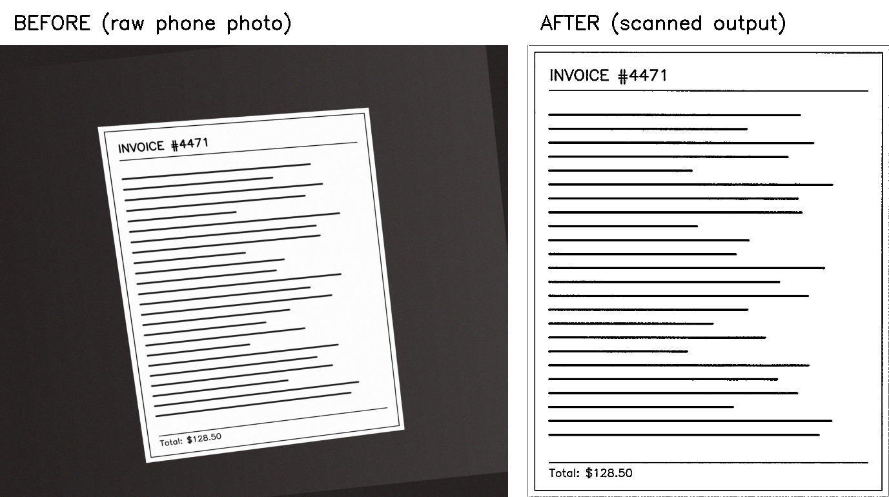

# Document Scanner

A small computer-vision CLI that turns a skewed, hand-held phone photo of a
printed page or receipt into a clean, flattened, high-contrast "scanned"
image — no phone scanning app required.



## How it works

1. **Preprocessing** — resize, grayscale, blur, Canny edge detection.
2. **Contour detection & perspective warp** — find the page's 4 corners in
   the edge map, order them consistently, and warp the perspective so the
   page becomes a flat rectangle.
3. **Enhancement** — adaptive thresholding for a crisp black-text-on-white
   "scanned" look that copes with uneven desk lighting.

See `docs/architecture_diagram.png`, `docs/workflow_diagram.png`, and
`docs/class_component_diagram.png` for the full breakdown, and
`statement.md` for the full project report.

## Setup

```bash
pip install -r requirements.txt
```

## Usage

Scan a single image:

```bash
python src/scan.py --input data/samples/photo1.jpg --output output/
```

Scan every image in a folder, also saving the intermediate edge maps:

```bash
python src/scan.py --input data/samples/ --output output/ --debug
```

### CLI options

| Flag        | Required | Description                                                        |
|-------------|----------|----------------------------------------------------------------------|
| `--input`   | Yes      | Path to a single image file, or a folder of images.                 |
| `--output`  | No       | Output directory (default: `./output`).                             |
| `--debug`   | No       | Also save the intermediate Canny edge-map image for each input.     |

Each run writes:
- One `<name>_scanned.png` per input image in `--output`
- `<name>_edges.png` per input image, only with `--debug`
- `output/results.csv` — one row per file: `filename, status, processing_time_s, output_path, error`

## Test images

`data/samples/` contains synthetic stand-in photos (a printed page/receipt
photographed at an angle on a contrasting desk), generated by
`scripts/generate_samples.py`, since this development environment has no
camera to shoot real phone photos with. Real phone photos work the same way
— just drop them into `data/samples/` (or point `--input` anywhere else).
`photo6_low_contrast.jpg` and `not_an_image.jpg` are deliberately awkward
cases used to exercise the fallback-contour path and the error handling.

## Running the tests

```bash
pip install -r requirements.txt
pytest tests/ -v
```

## Project structure

```
scanner-project/
├── src/
│   ├── preprocessing.py     # Module 1
│   ├── detect_and_warp.py   # Module 2
│   ├── enhance.py           # Module 3
│   ├── scan.py              # CLI entry point
│   └── utils.py
├── data/samples/            # test images
├── output/                  # scan results + results.csv (generated)
├── tests/
│   └── test_pipeline.py
├── docs/                    # diagrams + before/after screenshot
├── scripts/                 # sample/diagram generator helper scripts
├── README.md
├── statement.md             # full project report
└── requirements.txt
```

## Known limitations

- Best results need decent contrast between the page and the background
  (see Step 1 of the build plan). Low-contrast backgrounds fall back to a
  bounding-rectangle approximation, which is less accurate than a true
  4-point contour.
- Canny thresholds (75/200) are tuned for reasonably well-lit photos; very
  dark or very bright photos may need different thresholds.
